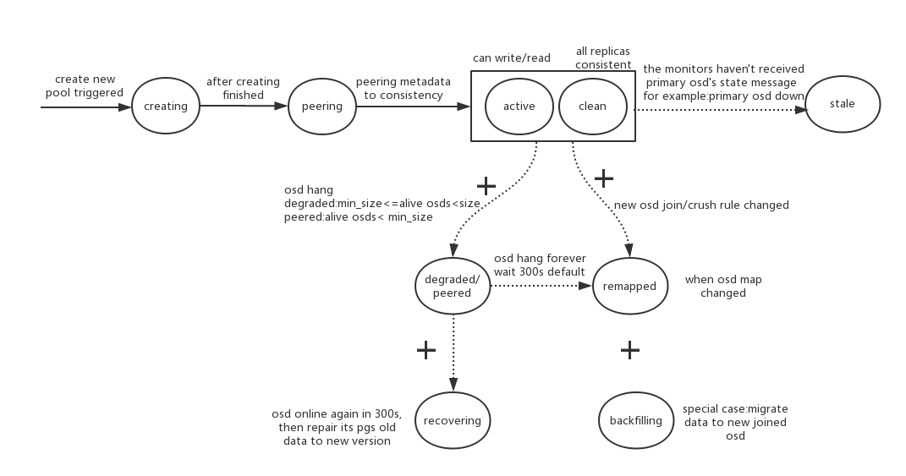

### ceph逻辑架构
Ceph是分布式存储系统，它的特点是：
* 高扩展性：使用普通x86服务器，支持大规模服务器分布式部署，支持TB到PB级的扩展。
* 高可靠性：没有单点故障，多数据副本，自动管理，自动修复。
* 高性能：数据分布均衡，并行化度高。对于objects storage和block storage,不需要元数据服务器。
下图为其逻辑架构:

ceph的逻辑架构，自下而上，分为4个层次
* 基础存储系统RADOS（Reliable, Autonomic, Distributed Object Store，即可靠的、自动化的、分布式的对象存储）

这一层本身就是一个完整的对象存储系统，c++实现，所有存储在Ceph系统中的用户数据事实上最终都是由这一层来存储的。
而Ceph的高可靠、高可扩展、高性能、高自动化等等特性本质上也是由这一层所提供的。在使用rados时，客户端直接
与OSD和monitor交互获取cluster map，根据crush算法，crush rule，计算出存储位置.

* 基础库librados

对rados进行的抽象和封装，使用c++实现，向上也支持各种语言如:java/python/ruby/php，注意:基于rados的对象存储功能，
而不是整个ceph。

* 高层应用接口：RBD、CephFS、RADOSGW。

* 具体使用场景的应用层:如基于RBD实现的云硬盘，基于librados实现的对象存储应用。

参考文章:

* http://www.uml.org.cn/yunjisuan/2014041107.asp
* https://www.ustack.com/blog/ceph_infra/
* http://www.cnblogs.com/sammyliu/p/4836014.html

### ceph物理架构
下图为其逻辑架构:

* OSD： Object Storage Device，提供存储资源。
* Monitor：维护整个Ceph集群的全局状态。
### 大文件保存到osd磁盘的流程
下图为流程图:

* File->obj映射:将大文件按照object的最大size(如4M)进行切分。切分后的object，按照文件的inode号和切分的ojbect序列号生成唯一的对象ID.
  即objectId = function(File.inode, object序列号)
* Object->PG映射，pg编号=hash(objectid)% pg_num，而pg-id=pool-id.pg编号，即pg-id=pool-id.hash(objectid)% pg_num，如4.58。
其他说明:pool是个逻辑概念，相当于命名空间，类似于lvm中的volume group(卷组)的概念，rbd image相当于logic volume(逻辑卷)的概念
注意:为什么会引入PG这一层:
  * 降低了metadata的数量，只需要管理PG的metadata就可以了,PG的数量远远小于object的数量。
  * 增加PG的数量，可以均衡每个OSD的负载，提高并行度。
  * 分隔故障域，提供数据的可靠性。
* PG->OSDS映射，通过crush算法计算pg到osd磁盘的位置，即osd-ids[1,2,3]=Crush(pg-id,cluser-map,crush rule)，
算法依赖:系统状态(cluster map)和Crush rule(存储策略)。其中cluster map改变一般为设备损坏和集群规模扩大两种情况会产生。
Crush rule一般不会改变。rush伪随机算法优势:
  * 算法稳定，由于集群规模扩大，大部分PG和OSD的映射关系不会改变。
  * 不需要查询，只需要在本机计算即可，高效。
  

### ceph强一致性
下图为client与osd交互的流程图

* Ceph的读写操作采用Primary-Replica模型，Client只向Object所对应OSD set的Primary发起读写请求，这保证了数据的强一致性。
* 当Primary收到Object的写请求时，它负责把数据发送给其他Replicas，然后Replicas保存后，分别向primary发送确认，primary确认副本
写入完成后，自己也完成写入，最后向client确认object最终写入。Primary才应答Object的写请求，这保证了副本的一致性。
采用上述流程的写入虽然满足了可靠性，但是整体会有延迟。因此ceph在此基础上进行二次确认的改进。

* 因此ceph分两次向client进行确认，请参考上图，当各osd都将数据写入到journal盘后，先向client发送第一次确认，
当最终写入磁盘后，在发送一个最终确认信号，客户端收到二次确认后，删除本地数据。(所以journal盘尽量用ssd)。
* 在写入方面，还注意一点，ceph中没有条带的概念，因为一个object是作为一个单独的的文件保存，但是可以控制RBD写入object的方式，
默认是一个object写满在写下一个object，通过制定order(2的22次方=4M),strip_unit(像条带大小或条带深度),strip_count(条带宽度)来控制
对对象的并行写入。为什么会出现条带技术,主要是单个存储设备会有最大I/O限制以及网络传输限制，当达到最大值，如果多个进程同时写，后面
的进程会阻塞，所以存储系统一般会支持条带化技术，把连续的信息分片存储于多个设备。
* 针对读操作，只需要发送给primary OSD即可，不需要发送给副OSD，因为ceph存储是以PG为单位，1个文件包括若干PG，若干个PG摊下来，那么几乎
所有的OSD都会收到读请求，所以从全局上也可以认为是负载均衡的。

### ceph状态图
个人理解:应该将ceph状态的名字改为ceph特征，因为对某一个事物，在某一个时刻只能有一个状态(微观粒子除外)，但是一个事物在同一时刻却具有
多个特征，实际上，ceph的pg，我们可以看到可以有多个"特征"，如“active+clean”，准确来说，应该是多个特征。
但既然大家都这么叫，那就没办法了!下图为ceph状态图，务必注意，ceph的状态是叠加的，即可能同时含有多个状态。图中“+”的含义就是叠加的意思

状态说明:
* Creating 创建中：PG 正在被创建。
* Peering 对等互联：表示一个过程，该过程中一个 PG 的所有 OSD 都需要互相通信来就PG 的对象及其元数据的状态达成一致。
处于该状态的PG不能响应IO请求。Peering的过程其实就是pg状态从初始状态然后到active+clean的变化过程。一个 OSD 启动之后，
上面的pg开始工作，状态为initial，这时进行比对所有osd上的pglog和pg_info，对pg的所有信息进行同步，选举primary osd和replica osd，peering过程结束，
然后把peering的结果交给recovering，由recovering过程进行数据的恢复工作。
* Active 活动的：Peering 过程完成后，PG 的状态就是 active 的。此状态下，在主次OSD 上的PG 数据都是可用的。
* Clean 洁净的：此状态下，主次 OSD 都已经被 peered 了，每个副本都就绪了。
* Down：PG 掉线了，因为存放其某些关键数据（比如 pglog 和 pginfo，它们也是保存在OSD上）的副本 down 了。
* Degraded 降级的：某个 OSD 被发现停止服务 （down）了后，Ceph MON 将该 OSD 上的所有 PG 的状态设置为 degraded，
此时该 OSD 的 peer OSD 会继续提供数据服务。这时会有两种结果：一是它会重新起来（比如重启机器时），
需要再经过 peering 过程再到clean 状态，而且 Ceph 会发起 recovery （恢复）过程，使该 OSD 上过期的数据被恢复到最新状态；
二是 OSD 的 down 状态持续 300 秒后其状态被设置为 out，Ceph 会选择其它的 OSD 加入 acting set，并启动回填（backfilling）数据到新 OSD 的过程，
使 PG 副本数恢复到规定的数目。详情可以参考 PG 的数据恢复过程。
* Recovering 恢复中：一个 OSD down 后，其上面的 PG 的内容的版本会比其它OSD上的 PG 副本的版本落后。在它重启之后（比如重启机器时），
Ceph 会启动 recovery 过程来使其数据得到更新。
* Backfilling 回填中：一个新 OSD 加入集群后，Ceph 会尝试级将部分其它 OSD 上的 PG 挪到该新 OSD 上，此过程被称为回填。
与 recovery 相比，回填（backfill）是在零数据的情况下做全量拷贝，而恢复（recovery）是在已有数据的基础上做增量恢复。
* Remapped 重映射：每当 PG 的 acting set 改变后，就会发生从旧  acting set 到新 acting set 的数据迁移。
此过程结束前，旧 acting set 中的主 OSD 将继续提供服务。一旦该过程结束，Ceph 将使用新 acting set 中的主 OSD 来提供服务。
* Stale 过期的：OSD 每隔 0.5 秒向 MON 报告其状态。如果因为任何原因，主 OSD 报告状态失败了，或者其它OSD已经报告其主 OSD down 了，
有几种可能，当主OSD正在两个OSD之间切换时，会短暂出现stale状态，当所有OSD都挂了时，会长期出现stale状态。
* incomplete:PG的OSD数目不足以进行数据恢复时，此时往往是OSD数目不够预设的副本数目了。

重点说明:
* Peering：互为副本的三个(此处为设置的副本个数，通常设置为3)pg的元数据达到一致的过程，达成一致后，各副本并不一定有了最新版本的数据。
处于peering状态的PG，会暂停处理IO请求，在生产环境中表现为集群部分IO不响应，甚至某些云主机因为等待IO造成应用无法正常处理
* Acting set:由crush算法分配的OSD有序列表，如[1,2,3]，其中1为主OSD，2和3为副OSD，不一定生效。
* Up set:大多数情况下，Acting Set与Up set是一致的，除非出现pg_temp。
  * pg_temp解释:假设当一个PG的副本数量不够时，这时的副本情况为acting/up  = [1,2]/[1,2]。这时添加一个OSD.3作为PG的副本。
    经过crush的计算发现，这个OSD.3应该为当前PG的primary，但是呢，这OSD.3上面还没有PG的数据，所以无法承担primary，所以需要临时申请一个acting set，
    这就是pg_temp，这个pg_temp就还采用OSD.1作为primary，此时pg的集合为acting，pg_temp的集合为up。当然pg与pg_temp是不一样的，
    所以这时pg的集合变成了[3,1,2]/[1,2,3]。当OSD.3上的数据全部都恢复完成后，就变成了[3,1,2]/[3,1,2]
* Up set可理解为当前正生效的OSD集合，Acting set可理解为crush算法算出来的最终期望达成的OSD集合。

参考文章
* http://docs.ceph.com/docs/master/rados/operations/pg-states/
* http://www.cnblogs.com/sammyliu/p/4836014.html

### cephx认证
cephx认证整体流程图：

cephx创建用户生成秘钥流程图：

cephx生成session key和ticket流程图：

说明:
* 安全方面的体系分为对称加密(或共享加密)和非对称加密(或公钥加密)，比如https综合使用了非对称加密和对称加密。
* 数字证书:在非对称加密中，目的为:保护公钥的安全，防止黑客用其非法公钥把自己的正常公钥给替换掉，需要找证书中心CA，
对公钥做认证，即证书中心用自己的私钥，对鲍勃的公钥和一些相关信息一起加密，生成"数字证书"（Digital Certificate），
浏览器中固化有CA的公钥，可以解开“数字证书”得到公钥。
* 数字签名:防止信息被篡改和证明信息确实是自己所发出。综合使用了单向的散列算法和非对称加密。
  * 先对信息用单向散列算法生成摘要。
  * 然后在对摘要用私有进行加密。
* ceph中的cephx认证即是对称加密(或共享加密)，当我们需要在某个节点访问ceph时，只需要安装ceph客户端程序和拷贝
ceph.client.${user}.keyring到/etc/ceph下，就可以执行ceph的相关命令了，如ceph -s --id ${user}

不太懂的部分:
* ceph认证时，为什么要获取session key呢，直接获取ticket不就行了吗?

参考:
* http://docs.ceph.com/docs/firefly/rados/operations/auth-intro/
* http://zhaozhiming.github.io/blog/2014/09/13/ceph-authentication-theory/

### ceph网络
网络架构图:

* public网络(或前端网络)，用于ceph客户端与ceph交互。
* cluster网络(或后端网络)，用户连接ceph各存储节点，在ceph大规模扩容的时候优势尤为明显。
我司的一个案例，在只有public网络时，增加OSD，由于ceph需要“搬数据”到新的OSD，导致升级
达5小时，如果有专门的集群网络(需要配备万兆交换机和光纤)，几分钟即可升级完成。

### crush算法
待写
* https://my.oschina.net/u/2460844/blog/531722
* http://www.cnblogs.com/sammyliu/p/4836014.html
* http://www.cnblogs.com/sammyliu/p/5568989.html (结尾也有类似的内容)