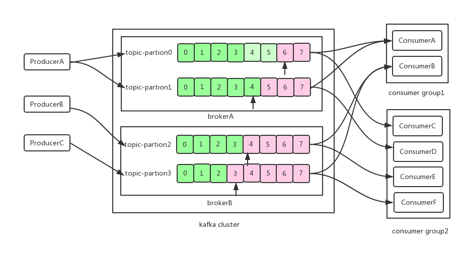

# What kafka
* Kafka is a distributed messaging system developed by LinkedIn, written in Scala.
* More and more distributed processing systems support the integration with Kafka such as Storm, Spark and Flink.
* More and more different types of companies use it as data pipelines and messaging systems.

# Related products comparison
|  Feature | ActiveMQ   | RabbitMQ   | RocketMQ | Kafka |
| ------------ | ------------ | ------------ | ------------ |------------ |
| Single machine throughput|  ten thousand |  ten thousand |  ten thousand | million |
| Availability | heigh(M/S) | heigh(M/S) | very heigh(distributed) | very heigh(distributed) |
| message missing| low | low | low | no |
| Maturity | heigh | heigh | heigh | heigh(for log) |
| Transaction | Y | Y | Y | N |

# Why use kafka
* High throughput
  100K messages per second transmission even in one cheap commercial machines.
* Persistence capabilities
  time complexity:O(1):even for the TB data, can also ensure constant time complexity of the access performance  
* Order guaranteed
  Can promise that the message is consumed in order for one partion.
* Scala out
  Support online horizontal expansion

# Key terms
* Topic: the logic concept of devide Message, a topic can be distributed on multiple broker.
* Partition: the basis for horizontal scaling and parallelism in Kafka, with each topic divided into at least one partition.
* Offset: the number of the message in its own partition.
* Broker: machines / services in the Kafka cluster, is a physical concept.
* Producer: produce and send message to broker
* Consumer: remove and consume the message from broker
* Consumer group: a logic concept, the same topic's data will be broadcast to different groups; consumers in the same group, only one
                              consumer can get this data.
* Replication: support for partition as a unit of redundant message backup
* Leader: Partition in each replication collection will select a unique leader, all read and write requests are handled by the leader

# Architecture

