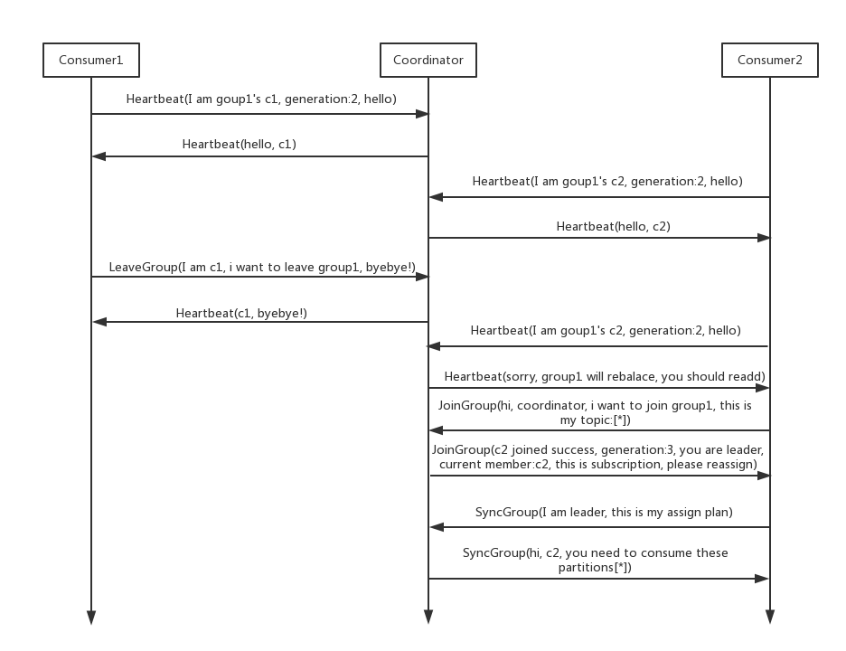

# what's rebalance
a protocol, defines how all consumers under a consumer group agree on how to allocate each partition subscribed to topic

# when do rebalance
  * member in consumer group changed: the new consumer joins the group, and the consumer has left the group or the existing consumer has crashed
  * the number of subscription topics has changed
  * the number of partitions for the subscription topic has changed

# who execute rebalance and manage consumer group
* coordinator(it is a broker which is decided by the first consumer in consumer group and kafka server together)
* the coordinator broker is `partition leader broker` which saved `that consumer group offsets info`
* don't depend on zookeeper when the kafka version >= 0.9, and introduce `group coordinator`

# rebalance generation

# how many protocols in rebalance protocol
* Heartbeat request: the consumer needs to periodically send a heartbeat to the coordinator to indicate that he is still alive
* LeaveGroup reqeust: the consumer told coordinator I want to leave the consumer group
* SyncGroup request: the leader consumer tells the distribution plan to all members of the group
* JoinGroup request: members request to join the group
* DescribeGroup request: show all information for the group

# rebalance scenes
* new consumer join

* consumer failure

* consumer leave group

# refer to
* http://www.aboutyun.com/thread-23447-1-1.html
